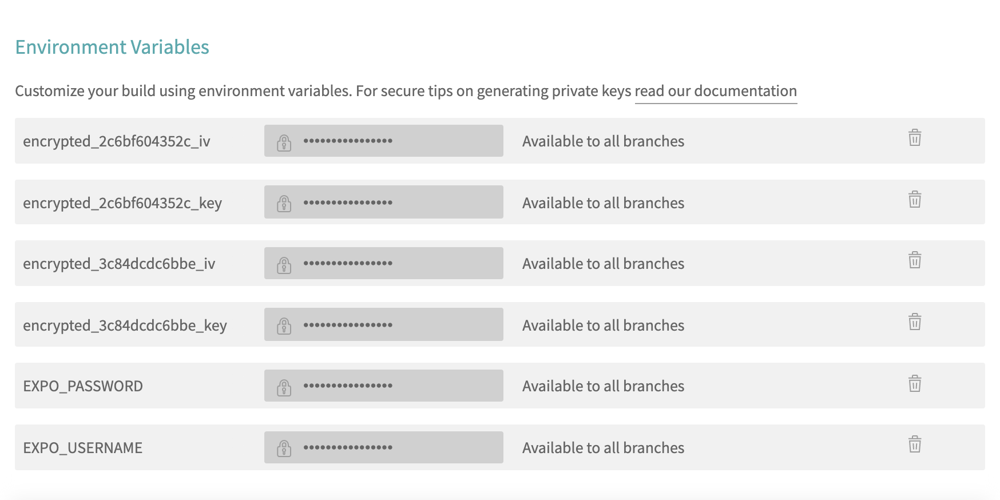

# VEHOGO

- [Content](#markdown-navigation)
  - [Introduction](#introduction)
  - [Introduction to Firebase](#firebase)
  - [Introduction to Google API](#google-API)
  - [Installation](#installation)
  - [Testing](#testing)
  - [Introduction to Cypress](#cypress)
  - [User testing](#user-testing)
  - [Change Log](#Change-Log)
  - [Maintainers](#maintainers)

## Introduction

VEHO-GO is an application made manly for the use of Veho company. It is a technology platform. Our smartphone app connects driver-partners and riders. We have used React-Native to create this application which is an open-source mobile application framework created by Facebook.

You can use your rider app to request a ride. When your workmate accepts your request, your app displays an estimated time of arrival for the driver-partner heading to your pickup location. Your app notifies you when the driver-partner is about to arrive.

Your app also provides info about the driver-partner with whom you will ride, including full name, vehicle type, and license plate number. This info helps the two of you connect at your pickup location.

Use your app to enter your work destination and also your work schedule for the week. If you have a preferred route, it's helpful to talk through the directions together. When you arrive at your destination and exit the vehicle, your trip ends.

## List of API's

### Firebase

Firebase is Google’s mobile application development platform that helps you build, improve, and grow your app. It provides developers with a variety of tools and services to help them develop quality apps, grows their user base, and earn profit. It is built on Google’s infrastructure. Firebase is categorized as a NoSQL database program, which stores data in JSON-like documents. <a href="https://medium.com/firebase-developers/what-is-firebase-the-complete-story-abridged-bcc730c5f2c0">More about Firebase...</a>

We have used firebase authentication to know the user’s identity, provide a customized experience, and keep the user’s data secure. <a href="https://firebase.google.com/docs/auth">More about authentication...</a>

We have also taken advantage of Firebase’s real-time database which is cloud-hosted. Data is stored as JSON and synchronized in real-time to every connected client. <a href="https://firebase.google.com/docs/database">More about database...</a>

### Google API

Google Map’s API is a robust tool that can be used to create a custom map, a searchable map, check-in functions, display live data synching with location, plan routes, or create a mashup just to name a few. <a href="https://medium.com/@helennnsays/why-when-and-how-to-use-the-google-map-api-f5dfa35986dc">More about Google Map API...</a>

What we have used Google Map API for:

<ol>
<li>Get the passengers and drivers location</li>
<li>Show the route between driver and passenger</li>
<li>Showing nearest road to destination</li>
</ol>

We have also used Google Places Autocomplete API to give our application the type-ahead-search behavior. The autocomplete service can match on full words and substrings, resolving place names, addresses, and codes. Applications can therefore send queries as the user types, to provide on-the-fly place predictions. <a href="https://developers.google.com/maps/documentation/places/web-service/autocomplete">Read more...
</a>

## Testing

As your codebase expands, small errors and edge cases you don’t expect can cascade into larger failures. Bugs lead to bad user experience and ultimately, business losses. One way to prevent fragile programming is to test your code before releasing it into the wild.

Testing helps you uncover these mistakes and verifies that your code is working. Perhaps even more importantly, testing ensures that your code continues to work in the future as you add new features, refactor the existing ones, or upgrade major dependencies of your project. <a href="https://reactnative.dev/docs/testing-overview">Read more...</a>

### Cypress

In this project, we have used Cypress as our testing platform. With Cypress, you can Run End to End tests. It checks whether a web application works as expected or not. <a href="https://www.browserstack.com/dg/cypress-testing?utm_source=google&utm_medium=cpc&utm_campaign=Search-NB-CypressTesting-TestKeywords-EMEA-Automate-CL&utm_adgroup=Cypress-End-to-End-Testing&utm_keyword=%2Bcypress%20%2Bend%20%2Bto%20%2Bend%20%2Btesting&utm_matchtype=b&gclid=Cj0KCQjwsqmEBhDiARIsANV8H3bT1GEoovqozRxwtsGSaWFry6alc8JLfeA5a_BY0od8Gvvl_J4uTLcaAvikEALw_wcB">Read more...<a>

Struction for using Cypress in our application:

1. In the root folder make a new file 'serviceAccount.json'
2. Authenticate with a Service Account <a href="https://sites.google.com/site/scriptsexamples/new-connectors-to-google-services/firebase/tutorials/authenticate-with-a-service-account">Link...</a>
3. Copy/paste the following code snipped in the serviceAccount.json

```{
{
  "type": "service_account",
  "project_id": "veho-go",
  "private_key_id": {"Private Key Id"},
  "private_key": {"Private Key"},
  "client_email": {"Client Email"},
  "client_id": {"Client Id"},
  "auth_uri": {"Auth URI"},
  "token_uri": {"Token URI"},
  "auth_provider_x509_cert_url": {"Auth Provider x509 Cert URL"},
  "client_x509_cert_url": {"Client x509 Cert URL"}
}

```

### User testing

For user testing, our goal was to lean more towards validation and evaluation. That is, finding out if users understand and enjoy our app, and whether the features meet their needs. For this, we leveraged early versions of our app, prototypes, and mockups. Veho provided us the user from inside of their company. The user didn't know anything about our app and used it the first time.


### Travis CI integration

To start testing with Travis CI you need to
  
Create Environment variables
    <p align="center">
      
    </p>
<a href="https://www.browserling.com/tools/random-hex">Generate Random hex codes for Travis encryption.  </a>    Generate a 32 digit code and one 64 for Travis CI

  
Download and add serviceAccount.json (<a href="https://sites.google.com/site/scriptsexamples/new-connectors-to-google-services/firebase/tutorials/authenticate-with-a-service-account#TOC-Generate-a-new-private-key">tutorial can be found here! </a> <b>Make sure to add serviceAccount.json to .gitignore!         </b>)
  
  
Encrypt serviceAccount.json and .env with: 
```
travis encrypt-file serviceAccount.json  --key 6f551e4882cbbda9b574f6f2c1358731b956ca5fcbde4c7b380255f3d4f3c6c7 --iv 11799b87a80967621a98deec50dfa860
```
```
travis encrypt-file .env --key 60b235c7c96e0c88a8fed4f2d92ead3e154482821e6754160281428cf2f722c8 --iv a4da9ce54b59590322eb2e18197b6972
```
<b>Replace 6f551e4882cbbda9b574f6f2c1358731b956ca5fcbde4c7b380255f3d4f3c6c7 and 11799b87a80967621a98deec50dfa860 with your own 64 digit HEX code. 
</b>
<b>Replace 6f551e4882cbbda9b574f6f2c1358731b956ca5fcbde4c7b380255f3d4f3c6c7 and a4da9ce54b59590322eb2e18197b6972 with your own 32 digit HEX code. 
</b>
  

## Installation

Assuming that you have [Node 12 LTS](https://nodejs.org/en/download/) or greater installed, you can use npm to install the Expo CLI command-line utility:

1. If needed, install code editor (+ extensions), git, npm</li>
2. Install Expo app to your phone. <a href="https://apps.apple.com/us/app/expo-client/id982107779">iOS</a>
   or <a href="https://play.google.com/store/apps/details?id=host.exp.exponent&hl=fi">Android</a></li>
3. Install expo CLI: <code>npm install -g expo-cli</code></li>
4. Clone the project: <code>git clone git@github.com:Vehonaattorit/VEHOGO.git</code></li>

Create new folder 'secrets'.

Inside secrets folder create a new file secrets.js and copy/paste the following code snippet in it</li>

```
const firebaseConfig = {
  apiKey: '(FIREBASE_CONFIG)',
  authDomain: '(FIREBASE_CONFIG)',
  projectId: '(FIREBASE_CONFIG)',
  storageBucket: '(FIREBASE_CONFIG)',
  messagingsenderID: '(FIREBASE_CONFIG)',
  appId: '(FIREBASE_CONFIG)',
  measurementId: '(FIREBASE_CONFIG)',
}
let googleMapsApiKey = '(GOOGLE_API_KEY)'
export {firebaseConfig}

```

Test that app works:

run it and open it in your emulator(the interactive shell is needed to get the menu option (A) for launching the emulator)

        > cd VEHOGO
        > npm start

## Change Log

<details>
<summary>Sprint 1:</summary>
<br>
  <ol>

<li>Goal in this sprint. Setting up development environment and working first version where user can navigate through different views.
 Firebase authentication implemented and firestore used for storing some data.</li>
  <br>
<li>Driver pages:
  <ul>
    <li>Get ride requests from firebase</li>
    <li>Visuals for showing ride requests and accepting them</li>
    <li>Ride offer stored in firebase</li>
  </ul>
  </li>
  <br>
 <li>SET UP views</li>
  <br>
<li>Authentication / Firebase setup</li>
  <br>
<li>ESLint setup</li>
  <br>
<li>Passenger reservation pages</li>
  <br>
<li>Driver related pages</li>
  <br>
<li>Continuous Integration</li>
  <br>
<li>Map route/Navigation with location updates</li>
  <br>
<li>Chat:
<ul>
  <li>Implemented with Firebase Firestore
  </li>
  </ul>
</li>
</ol>
</details>
<details>
<summary>Sprint 2:</summary>
<br>
  <ol>
  <li>Outlook Calendar:
    <ul>
      <li>Going to work</li>
      <li>Coming from work</li>
      <li>mock up data</li>
      <li>sync to Outlook calendar</li>
    </ul>
  </li>
  <br>
<li>TravisCI</li>
  <br>
    <li>Chat Screen</li>
  <br>
<li>Passenger Screen</li>
  <br>
<li>Continuing the implementation of setup screens</li>
  <br>
<li>Fix Outlook Calendar: Android phone doesn't redirect to app screen after logging in to Outlook. Feature only WORKS in iOS.</li>
  <br>
<li>First Version of maps</li>
  <br>
<li>More work with driver pages</li>
  <br>
      <li>Authentication (Firebase)
    <ul>
      <li>Sign in</li>
      <li>Log in</li>
      <li>Firestore</li>
    </ul>
  </li>
  <br>

</ol>
</details>

<details>
<summary>Sprint 3:</summary>
<br>
  <ol>

<li>Setup screen improvements
  <ul>
    <li>Time picker problem. App crashes when picking time</li>
    <li>App is going to home page before setup is done. Upload the last data after the user has seen the. Setup Completed screen</li>
    <li>One additional screen for asking users name</li>
      <li>Add same address picker from company screen to userscreen</li>
      <li>Error: Native splash screen is already hidden. Call this method before rendering any view.</li>
      <li>Add new screen for asking users name</li>
  </ul>
  </li>
  <br>
<li>Driver worktip flow
  <ul>
    <li>Create as many worktrip documents for user as user has worktrips. for example user goes to work 2 days of week. 4 worktrip documents will be created</li>
    <li>When user adds work times. Add these values to scheduledDrive object inside the workTrip document.</li>
    <li>When user adds home location. Add this as first location in Stop object array. This is inside the scheduled drive.</li>
  </ul>
  </li>
  <br>
<li>Company setup screen
  <ul>
    <li>Option from setup screen to either create a company or join a company. After the company created the normal setup would start</li>
    <li>The screen that asks companys name</li>
    <li>Add address with Google Geocoding API query. Send http request with address parameter and let user click the answers. See the first attachment file</li>
      <li>In setup screen user either joins or creates a company. When user clicks join company. List all the companys by name and add ability to search for companys</li>
  </ul>
  </li>
  <br>
<li>figma desing improvements</li>
  <br>
<li>Google Autocomplete implementation</li>
  <br>
<li>Company Creation and Joining</li>
  <br>
<li>Push Notifications</li>
  <br>
<li>
  Starting the drive and go through all the stops
  <ul>
    <li>Check if the current time matches with any of the drivers worktrips</li>
     <li>Show user a button which he can use to start the drive.</li>
     <li>Show preview screen of all the stops and time ETA</li>
     <li>Update users location live to the firebase</li>
  </ul>
</li>
  <br>
<li>
  Figma design and communication with customer
</li>
  <br>
  <li>Driver passenger request listing
  <ul>
    <li>List that displays all the passenger request for the drivers car</li>
    <li>when driver clicks the request. App shows the preview of the new route that takes to new passenger.</li>
    <li>Preview shows new estimated time when driver has to start driving</li>
    <li>After driver has accepted or refused the drive. Show push notification for passenger</li>
    <li>Driver can either accept or refuse the passenger</li>
    <li>Add the new users stop to worktrip data under company</li>
  </ul>
    <br>
  <li>Drive listing
      <ul>
        <li>Show only if user is a passenger</li>
        <li>User can choose to filter the to work trips and to home trips based on users toHome and toWork times</li>
        <li>User can then request a ride by clicking the card and seeing the overview of the ride (layout the route, place icons/markers appropriately)</li>
        <li>Add a pending ride request inside the worktrip datamodel</li>
        <li>Firebase Stamp in WorkingHours workDayStart & workDayEnd</li>
      </ul>
    </li>
</ol>
</details>

<details>
<summary>Sprint 4:</summary>
<br>
  <ol>
<li>Styling of main page</li>
  <br>
<li>
  Create Route between stop locations and show it in map.
 </li>
      <br>
  <li>Starting the drive and go through all the stops
      <ul>
        <li>check if the current time matches with any of the drivers worktrips</li>
        <li>show user a button which he can use to start the drive.</li>
        <li>Show preview screen of all the stops and time ETA</li>
        <li>Show navígation screen and update users location live to the firebase</li>
        <li>Show map Screen and all of the stop locations</li>
      </ul>
    </li>
  <br>
<li>map Icons update</li>
  <br>
<li>ride request accept  polylines</li>
  <br>
<li>Driver location updated and displayed in driving map view and passenger view</li>
  <br>
<li>Passenger can inspect the route before requesting ride</li>
  <br>
<li>Design and color updates to all the views</li>
  <br>
<li>Redesign MainPage Driver & Passenger etc.</li>
  <br>
</ol>
</details>

<details>
<summary>Sprint 5:</summary>
<br>
  <ol>
<li>Live chatting implementation:
  <ul>
    <li>You can send messages to other person.</li>
    <li>Notifications when new message is received</li>
    <li>Quick message templates for driver to send quick response or message to passenger. (For example: "5 mins and there.", "Where I can pick you up?")</li>
  </ul>
  </li>
  <br>
 <li>Navigation back to mainpage and data updating when needed</li>
  <br>
<li>Notify Driver to create/add car before starting ride or accepting passengers.</li>
  <br>
<li>add phone number and full name to the user data model and ask it in register.</li>
  <br>
<li>email verification. User is required to verify email before joining to company</li>
  <br>
<li>Work trip progress. Logic for picking up passengers</li>
  <br>
<li>Show driving destinations in a better way and change destination when carousel scrolled</li>
  <br>
<li>car implementation to the worktrip data model</li>
  <br>
<li>login screen remake</li>
</ol>
</details>

<details>
<summary>Sprint 6:</summary>
<br>
  <ol>

<li>Redesign the SETUP views React Native</li>
  <br>
<li>Outlook Calendar:
  <ul>
    <li>Schedule rides to events</li>
    <li>Login to Microsoft Outlook</li>
    <li>Create a new event with logged in user</li>
  </ul>
  </li>
  <br>
 <li>BUG FIXES & IMPROVEMENTS IN APP FEATURES</li>
  <br>
<li>BUGS & expo build</li>
  <br>
<li>domain verification:
  <ul>
    <li>Parse users email when user is creating a new company and add this to companys default domain</li>
    <li>Prompt user to add different domain policy. for example one where different domains are allowed to join and are only notified</li>
    <li>seconds domain policy where only allowed domains are able to join a company</li>
  </ul>
  </li>
  <br>
<li>Start Ride Driver list updates in real time</li>
  <br>
<li>ActiveRide bar passenger displayed to user</li>
  <br>
<li>When driver stops ride -> passenger exits Route screen</li>
  <br>
<li>Map route/Navigation with location updates</li>
  <br>
<li>Week days displayed in Passenger List for User</li>
<br>
<li>better query for rides</li>
<br>
<li>Solve why Google Maps does not work in built APK</li>
<br>
<li>'Your driver is on its way' Active ride passenger bar functionaility</li>
<br>
<li>Start Ride Main Button does not lead anywhere</li>
<br>
<li>Bug fixing</li>
<li>Client testing day</li>
<li>add the time estimate for each stop in work trips</li>
<li>Convert the workdays to start from sunday and end in saturday</li>
<li>Chat System feature polishing</li>
</ol>
</details>

<details>
<summary>Sprint 7:</summary>
<br>
  <ol>

<li>Firebase rules</li>
  <br>
<li>Settings view</li>
  <br>
 <li>Outlook Calendar sign up in StandAlone</li>
  <br>
<li>Setup & Settings screen(s)</li>
</ol>
</details>

<details>
<summary>Sprint 8:</summary>
<br>
  <ol>
    <li>Update worktrip route when passenger cancels his/hers stop.</li>
    <br>
<li>Fixes & Small features
  <ul>
    <li>Fix setup screen working hours</li>
    <li>Working Day gets its default values setup by user from firebase</li>
    <li>Send push notification to passengers, when driver starts ride</li>
      <li>What weekday is passenger requesting</li>
      <li>'Your driver is on its way' ride bar should provider driver's name for passenger user</li>
      <li>Pressing on passenger request notification takes driver to PassegnerRequest view.</li>
  </ul>
  </li>
  <br>
<li>Driver worktip flow
  <ul>
    <li>Create as many worktrip documents for user as user has worktrips. for example user goes to work 2 days of week. 4 worktrip documents will be created</li>
    <li>When user adds work times. Add these values to scheduledDrive object inside the workTrip document.</li>
    <li>When user adds home location. Add this as first location in Stop object array. This is inside the scheduled drive.</li>
  </ul>
  </li>
  <br>
<li>Better Register and login validation</li>
  <br>
<li>implemented Active Rides List on passenger's side. Display drivers that have started driving</li>
  <br>
<li>added state to SetupInit so user can't spam the button and create more workTrips</li>
  <br>
<li>Creating more tests for Travis CI</li>
  <br>
<li>Setup & Settings Modals</li>
</ol>
</details>

<details>
<summary>Sprint 9:</summary>
<br>
  <ol>
    <li>Update worktrip route when passenger cancels his/hers stop.</li>
    <br>
<li>Cypress e2e testing
  <ul>
    <li>passengerSetup</li>
    <li>driverSetup</li>
  </ul>
  </li>
  <br>
<li>Outlook Calendar login, response & redirection
  </li>
  <br>
<li>Passenger view, show rides that have  same day as prefered working days.</li>
  <br>
<li>Passenger page show only available seats (e.g not 1/4)</li>
  <br>
<li>In driver mainpage, pressing start ride causes crash.</li>
  <br>
<li>Readme file</li>
  <br>
<li>Passenger Pending Ride Requests MainButton, list pending requests & remove button</li>
</ol>
</details>

<details>
<summary>Sprint 10:</summary>
<br>
  <ol>
<li>GET Outlook Calendar WORKING AGAIN !, share to ride Event
  </li>
  <br>
<li>Slides for presentation
  </li>
  <br>
<li>App Icon & Splash Screen</li>
</ol>
</details>

## Maintainers

@Kurosh Husseini <a href="https://github.com/kurosh97">Github Link...</a><br/>
@Juhana Tamminen <a href="https://github.com/JuhanaTa">Github Link...</a><br/>
@Niklas Nilsson <a href="https://github.com/Jalsson">Github Link...</a><br/>
@Michael Lock <a href="https://github.com/thelockymichael">Github Link...</a><br/>
